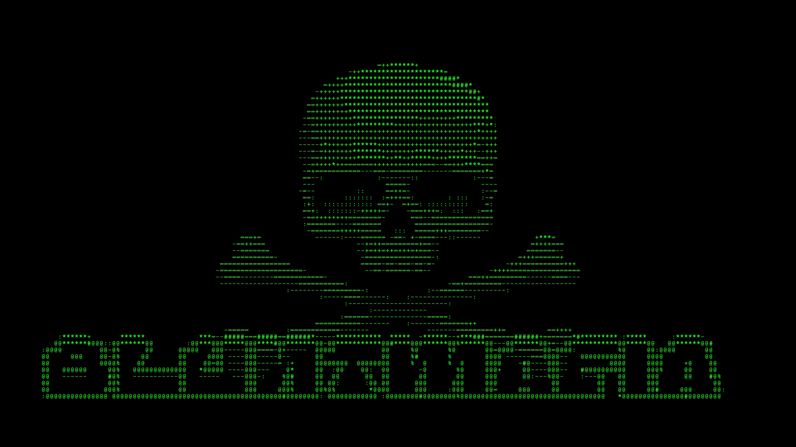

# vid — ASCII Video Converter

Инструмент для конвертации видео в **ASCII‑арт** с поддержкой работы из терминала (CLI) и через графический интерфейс (GUI). Репозиторий содержит две основные версии: консольную (`vid2.py`) и оконную (`vid3_0.1.6.py`).



## Возможности

- Конвертация видео в ASCII‑анимацию с настройкой ширины, стиля и цветов.
- Сохранение результатов в:
  - текстовые кадры (`frame_XXXXXX.txt`);
  - PNG‑изображения в оригинальном разрешении;
  - MP4‑видео, собранное из ASCII‑кадров с разным качеством (CRF / без потерь).
- Центрирование текста, выбор цвета фона, поддержка прозрачных областей по порогу яркости.
- Режим зацикленного воспроизведения ASCII‑видео в терминале и живой предпросмотр в GUI.
- Дополнительные “камерные” настройки (яркость, контраст, гамма) в GUI‑версии.

---

## Архитектура и файлы

| Файл            | Назначение                                                                 |
|-----------------|----------------------------------------------------------------------------|
| `vid2.py`       | CLI‑версия: работа в терминале, меню настроек, вывод ASCII‑видео в консоль и сохранение артефактов. |
| `vid3_0.1.6.py` | GUI‑версия на CustomTkinter/Tkinter + pygame, предпросмотр и конвертация с ползунками и кнопками. |

---

## Установка

### Требования

- Python 3.10+ (рекомендуется).
- FFmpeg, установленный в систему и доступный из `PATH` (для сборки `.mp4`).
- Для GUI‑версии (`vid3_0.1.6.py`) требуются пакеты Python:
  - `customtkinter`
  - `opencv-python`
  - `pygame`
  - `Pillow`
  - `numpy`

### Установка зависимостей
```
pip install customtkinter opencv-python pygame pillow numpy
```


Проверь, что FFmpeg установлен и доступен из командной строки:
```
ffmpeg -version
```


Если команда не находится, установи FFmpeg через пакетный менеджер (Linux/macOS) или скачай бинарники с сайта ffmpeg.org и добавь в `PATH` (Windows).[web:1]

### Клонирование репозитория
```
git clone https://github.com/Timoxa760/vid.git
cd vid
```


## Использование (CLI, `vid2.py`)

Запуск:
```
python vid2.py
```

После запуска в терминале откроется интерактивное меню.
### Основной сценарий

1. Введи путь к видеофайлу  
   Примеры:
   - `C:/videos/input.mp4`
   - `/home/user/videos/input.mp4`
2. Открой меню настроек и выбери:
   - **Ширину** ASCII‑кадра в символах (можно привязать к ширине терминала).
   - **Стиль вывода**:
     - обычный / инвертированный;
     - с прозрачным фоном или без;
     - порог прозрачности по яркости пикселя.
   - **Цвет текста**:
     - фиксированный;
     - случайный по кадрам или символам;
     - без окраски (монохром).
   - **Цвет фона** для PNG/видео.
   - **Качество шрифта** (`high` / `medium` / `low`) для отрисовки PNG и видео.
   - Что сохранять:
     - TXT;
     - PNG;
     - MP4.
3. Запусти конвертацию и дождись окончания.

### Структура выходных файлов (CLI)

Результаты сохраняются в папку:

~/Downloads/ASCII_Videos/<имя_видео>_<набор_настроек>/


Внутри создаются подпапки:

- `frames/` — текстовые и/или PNG‑кадры;
- `video/` — итоговые видеофайлы `.mp4`, если включено сохранение видео.


## Использование (GUI, `vid3_0.1.6.py`)

Запуск:
```
python vid3_0.1.6.py
```

Откроется окно на CustomTkinter.

### Основные элементы интерфейса

- Кнопка **выбора файла** — выбор видео для конвертации.
- Поля/слайдеры для:
  - ширины ASCII‑кадра в символах;
  - коэффициента высота/ширина (определяет число строк).
- Блок “камеры”:
  - яркость;
  - контраст;
  - гамма.
- Чекбоксы стиля:
  - инверсия;
  - прозрачный фон по порогу яркости;
  - случайные цвета текста.
- Выбор цвета текста и фона через colorpicker.
- Выбор качества итогового MP4:
  - низкое / среднее / высокое / без потерь (меняются параметры FFmpeg).
- Чекбоксы сохранения:
  - TXT;
  - PNG;
  - MP4.
- Кнопка **“Запустить конвертацию”**:
  - старт обработки в отдельном потоке;
  - отображение прогресса и статуса.

### Структура выходных файлов (GUI)

Базовая папка:

~/Downloads/ASCII_Videos/<YYYY-MM-DD_HH-MM-SS>/


Внутри:

- `frames/` — итоговые текстовые и/или PNG‑кадры;
- `temp/` — временные PNG для сборки видео (удаляется после завершения);
- `ascii_video.mp4` — готовое видео в корне папки проекта.

---

## Как это работает

- Кадры читаются через `cv2.VideoCapture` (OpenCV). Видео разбивается на отдельные кадры.
- Каждый кадр переводится в градации серого, к нему по желанию применяются:
  - настройка яркости/контраста/гаммы (в GUI);
  - инвертирование изображения.
- Кадр ресайзится в сетку `width × height_chars`, затем значения яркости мапятся на список ASCII‑символов (например, `@%#*+=-:.`).
- Для PNG/видео создаётся поверхность `pygame` размером исходного кадра. ASCII‑строки отрисовываются на ней выбранным шрифтом, с центрированием относительно оригинального кадра.
- FFmpeg собирает видео по маске `frame_%06d.png` с заданным FPS и параметрами качества (CRF/битрейт/без потерь).

---

## Примеры

### Минимальный пример CLI
```
python vid2.py
```
указать путь к видео
выбрать ширину 120 символов
включить сохранение PNG + MP4
запустить конвертацию

После завершения обработки открой получившееся видео из папки `~/Downloads/ASCII_Videos/.../video/`.

### Минимальный пример GUI

1. Запусти 
```
python vid3_0.1.6.py
```
2. Выбери видеофайл через кнопку.
3. Задай, например:
   - ширина: 120;
   - высота/ширина: 0.5;
   - средняя яркость/контраст/гамма (по умолчанию).
4. Отметь сохранение PNG + MP4.
5. Нажми «Запуск конвертации» и дождись завершения.


## Планы развития

- Более гибкий выбор шрифтов (указание своего TTF/OTF в настройках).
- Пакетная обработка нескольких видео за один запуск.
- Режим live‑потока с веб‑камеры (реальное время → ASCII).
